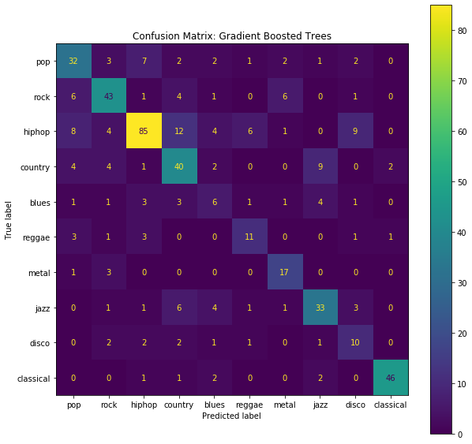

# Machine Learning for Music Genre Classification
## Random Forest & Gradient Boosted Trees

**Author**: Kevin Giroux

The contents of this repository detail an analysis of the Module 3 project. This analysis is detailed in hopes of making the work accessible and replicable.


### Introduction and Business problem:

As a lifelong musician, I am personally very interested in the problem of genre identification for music where the genre is unknown, using measurable data extracted from the waveform of a given audio sample. 

As a stepping stone toward the above project, I will use this notebook to teach a supervised classification model to differentiate between 10 different musical genres, based on 10 features retrieved from track metadata as stored in Spotify's API (Note:  some of these features can be derived from the track waveform, e.g. 'loudness', others of which cannot, e.g. 'popularity').

The primary goals of this work are (1) to develop an understanding for which features are most important to the musical genre classification problem and (2) to get a sense for whether genre classification based purely on an audio waveform or audio fingerprint might be possible.


### Data
For this analysis, I used data pulled from Spotify's API (via Kaggle), which included the following 10 features upon which my classification models are built:

- Acousticness - a confidence measure from 0.0 to 1.0 of whether the track is acoustic.
- Danceability - a measure of how suitable a track is for dancing based on a combination of musical elements including tempo, rhythm stability, beat strength, and overall regularity.
- Energy - a perceptual measure of intensity and activity. Typically, energetic tracks feel fast, loud, and noisy. For example, death metal has high energy, while a Bach prelude scores low on the scale. Perceptual features contributing to this attribute include dynamic range, perceived loudness, timbre, onset rate, and general entropy.
- Instrumentalness - predicts whether a track contains no vocals.
- Liveness - a confidence measure that detects the presence of an audience in the recording. 
- Loudness - the overall loudness of a track in decibels (dB), as averaged across the entire track
- Speechiness - detects the presence of spoken words in a track. The more exclusively speech-like the recording (e.g. talk show, audio book, poetry), the closer to 1.0 the attribute value. 
- Valence - A measure from 0.0 to 1.0 describing the musical positiveness conveyed by a track. Tracks with high valence sound more positive (e.g. happy, cheerful, euphoric), while tracks with low valence sound more negative (e.g. sad, depressed, angry).
- Tempo - a measure of the speed of a track, in beats per minute.
- Popularity


## Methods
- Genre mapping: a manual roll-up of groups of sub-genres into their appropriate macro-genre categories (which are the genres the model will be predicting:  Pop, Rock, Hip Hop, Country, Blues, Metal, Reggae, Jazz, Disco, and Classical)
- Data cleaning: this primarily consisted of reformatting of the Spotify data to only include items that fall into one of the ten macro-genre categories listed above
- Descriptive analysis: a review of each of the 10 predictive feature included in the original dataset
- Model fitting: created a set of 5 training datasets to train each classification model on:
    - Unmodified
    - Min / Max scaled
    - 7 feature set, with the 3 lowest-variance predictive features removed
    - Modified to meet the assumptions behind logistic regression
    - SMOTE modified to correct for class imbalance issues between genre categories
- Baseline model selection: comparison of 5-fold cross-validated accuracy scores for each of the above training datasets for each of the following algorithms:
    - Logistic regression
    - Decision tree
    - K-nearest neighbors
    - Gaussian Naive Bayes
    - Random Forest
    - AdaBoost
    - Gradient Boosted Trees
    - XGBoost
    - Support Vector Classifier
- Hyperparameter Tuning: 
    - Ran 2 to 3 gridsearch's on the top four performing models (Support vector classifier, K-nearest neighbors, Random forest, Gradient boosted trees) to identify the top 1-2 "winning" models


## Results


#### Distribution of target variable

> This pie chart shows the distribution of genre categories in the dataset.

#### Gradient Boosted Trees: Feature Importances

> Most important features: Acousticness, Danceability, Energy, Speechiness, Valence, Popularity

#### Gradient Boosted Trees: Confusion Matrix

> Highest performing genres: Hip Hop, Classical;  Lowest performing genres: Blues, Disco

#### Random Forest: Feature Importances

> Most important features: Acousticness, Danceability, Energy, Speechiness, Valence, Popularity

#### Random Forest: Confusion Matrix

> Highest performing genres: Hip Hop, Classical;  Lowest performing genres: Blues, Disco


## Conclusions:

1. Model accuracy
    - Gradient Boosted Trees F1 score: 66.2%
    - Random Forest F1 score: 64.1%
2. 5 of top 6 most important features are derived from the audio fingerprint / waveform of a track
    - Acousticness
    - Energy
    - Danceability
    - Speechiness
    - Valence
3. Popularity is the only feature in the top 6 not deriveable from a waveform
4. Least important to genre prediction are loudness, liveness, instrumentalness, and tempo
    - This result makes sense, as tracks within each genre category could easily vary widely along all four of these parameters, depending, for example, on
        - How each individual track was mastered (loudness),
        - Whether the track is a live or studio recording (liveness),
        - If the vocal stems of a track were removed to create an instrumental mix (instrumentalness).
        - Similarly, tempo can vary significantly within a given genre category


## Limitations & Next Steps

1. Limitations:  Precision and recall scores were both about equal for both models, with the same strenghths and weaknesses as far as which genres the models were best and worst at classifying.
    - The models were both best at identifying Classical, Metal, and Hip Hop
    - The models were both bad at identifying Blues and Disco
    - These similar results across models could be due to the fact that both models rely on tree-based algorithms

See below for specifics, by model:

Gradient Boosted Trees:
- Recall:  47% of all BLUES tracks were incorrectly classified as either HIP HOP, COUNTRY, or JAZZ
- Precision:  36% of all predicted BLUES tracks were actually either JAZZ or HIP HOP
- Precision:  33% of all predicted DISCO tracks were actually HIP HOP

Random Forest
- Recall:  52% of all BLUES tracks in the dataset were incorrectly classified as either ROCK or HIP HOP
- 65% of all predicted BLUES tracks were actually JAZZ, COUNTRY, HIP HOP, or ROCK
- 38% of all predicted DISCO tracks were actually HIP HOP

2. Next Steps:  
- Expand the dataset to include additional unique examples of Blues and Disco tracks, which were the most difficult for the models to classify correctly.
- Experiment with building a series of models that are trained only on the top 6 most important features identified in this phase of the project.
- Kick off an in-depth genre mapping exercise which will inform the training of future, more sophisticated versions of these models.

### For further information
Please review the narrative of our analysis in [our jupyter notebook](./student.ipynb) or review our [presentation](./presentation_vF.pdf)

For any additional questions, please contact **kevinsgiroux@gmail.com)


##### Repository Structure:

├── README.md                 <- The top-level README for reviewers of this project
├── student.ipynb             <- narrative documentation of analysis in jupyter notebook
├── presentation.pdf          <- pdf version of project presentation
├── data                      <- raw data and column description files
├── other                     <- other ancillary files included in the originally forked repo
└── images
    └── images                <- visualizations generated from code

```
